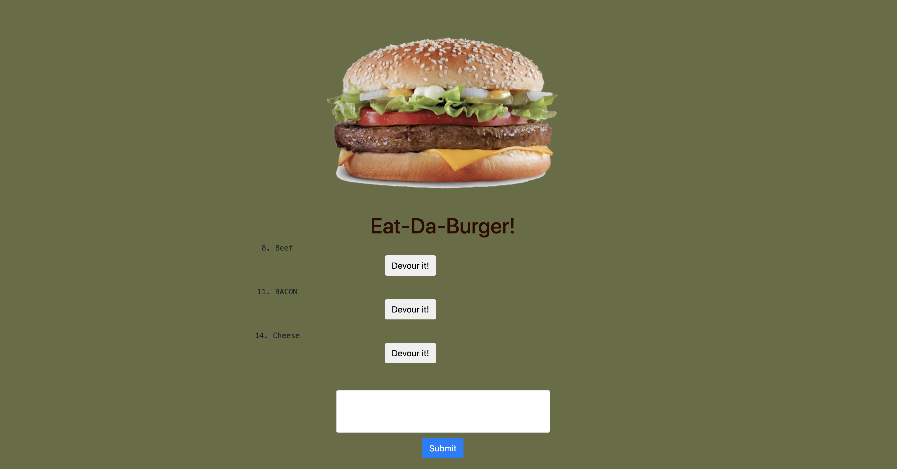

<h1 align="center">Eat the Burger App
  
## Description
 This web application will alow you to create new burgers and devour the burger !
 
## Table of Contents
- [Description](#description)
- [Table of Contents](#table-of-contents)
- [Installation](#installation)
- [Usage](#usage)
- [License](#license)
- [Contributing](#contributing)
- [Tests](#tests)
- [Questions](#questions)
## Installation
 Clone Repo, Run Command `npm i`, Then node server.js
## Usage
 This application will create burgers and when you click on the devour it will delete them.
## License

  
 
This application is covered by the Open license. 
## Contributing
 Luis Feliz 
## Tests
 n/a
## Questions
 luisfeliz@gmail.com 
 
 GitHub:  
 
 Email me with any questions: luisfeliz@gmail.com  

 
[HEROKU](https://burger-eat-in.herokuapp.com/burgers) 
 

